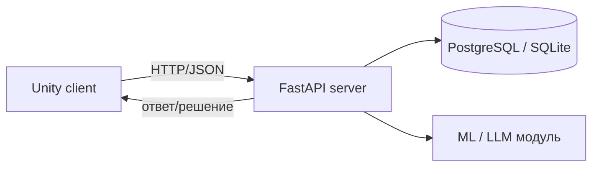

# <Название проекта>

> Курсовая работа по дисциплине «Игровой искусственный интеллект» (ВолгГТУ).
> **Тема:** … · **Индустриальный кейс:** … · **Студент:** … · **Руководитель:** …

Гибридная архитектура: **Unity-клиент** (`client/`) + **Python-сервер** (`server/`, FastAPI).
Подходит для тем с телеметрией, ML-классификаторами, LLM-шлюзами, DDA.



## Быстрый старт

```bash
# сервер
cd server && python -m venv .venv && source .venv/bin/activate
pip install -e ".[dev]" && uvicorn gameai_server.app:app --reload
# или всё вместе: docker compose up --build   (сервер + БД)
# клиент: откройте client/UnityProject в Unity 2022.3 LTS (см. client/README.md)
```

Контракт между клиентом и сервером — `contracts/openapi.yaml`. Меняете API → сначала меняете контракт.

## Структура

```
client/UnityProject/    Unity-проект (LFS настроен)
client/starter/         заготовки: HTTP-клиент, логгер телеметрии
server/src/gameai_server/  FastAPI-приложение, модели, ML-модуль
server/tests/           pytest
contracts/              OpenAPI-контракт
experiments/ results/   эксперименты и метрики
docs/report/ docs/adr/  записка и решения
```

Этапы работы — 6 вех (см. Issues, `scripts/setup_github.sh`).
